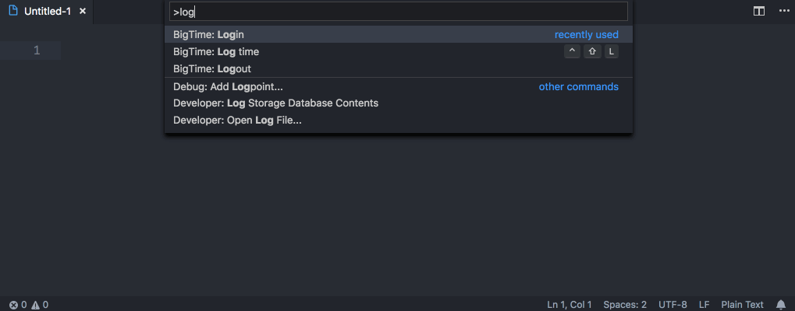
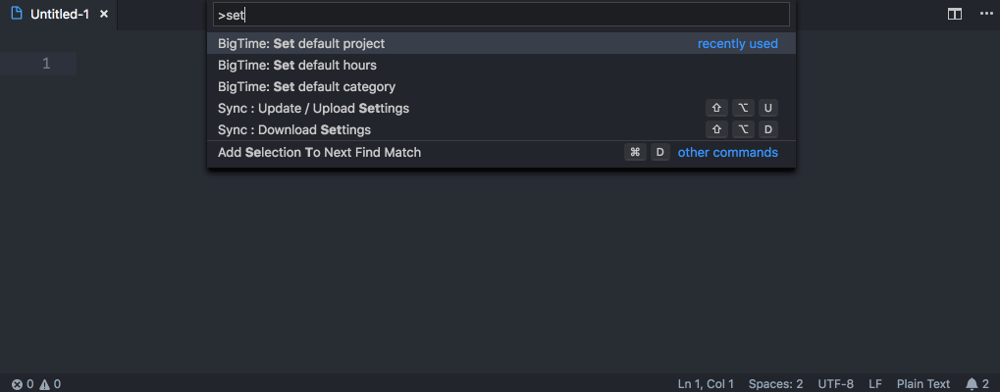
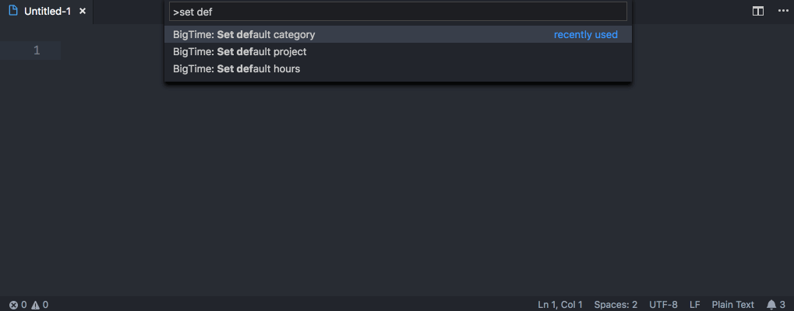
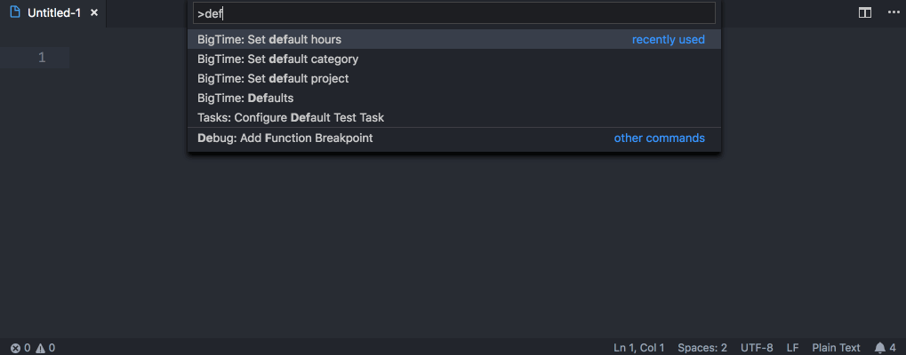
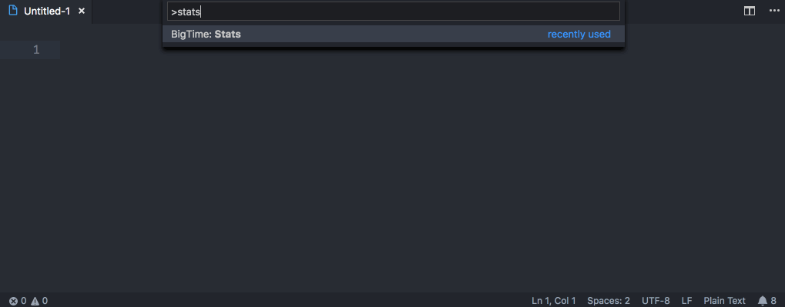
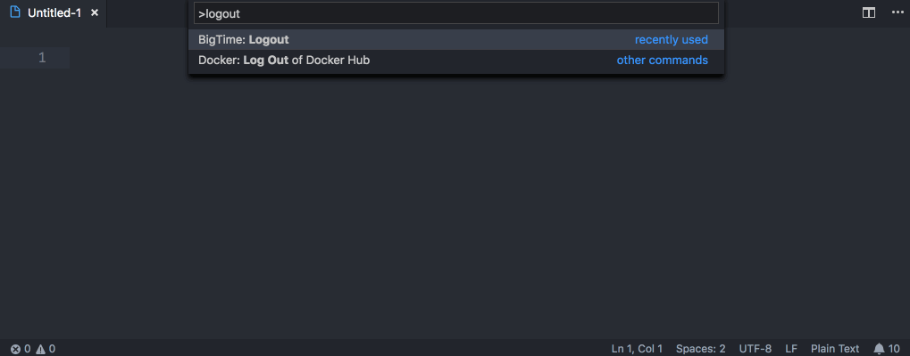

# VS Code BigTime Extension
Log your time in [BigTime](https://www.bigtime.net/) straight from [VS Code](https://code.visualstudio.com/).

[](https://travis-ci.org/john-goldsmith/vscode-bigtime)
[](https://codeclimate.com/github/john-goldsmith/vscode-bigtime/test_coverage)
[](https://codeclimate.com/github/john-goldsmith/vscode-bigtime/maintainability)
[](https://coveralls.io/github/john-goldsmith/vscode-bigtime?branch=develop)
[](https://david-dm.org)
[](https://snyk.io/test/github/john-goldsmith/vscode-bigtime) [](https://greenkeeper.io/)

## Features

### Login to BigTime
Command Palette > BigTime: Login



### Set a default project
Command Palette > BigTime: Set default project



### Set a default category
Command Palette > BigTime: Set default category


### Set a default number of hours
Command Palette > BigTime: Set default hours



### See saved defaults
Command Palette > BigTime: Get defaults



### Log time, using either defaults or manual entry
Command Palette > BigTime: Log time

Shortcut: `Shift`+`Ctrl`+`L`


### Get week-to-date and month-to-date totals
Command Palette > BigTime: Stats



### Logout of BigTime
Command Palette > BigTime: Logout



### Launch the BigTime website
Command Palette > BigTime: Go to website

## Running Locally & Debugging

1. Clone this repo
1. Run `npm install`
1. In the Debug panel, choose the "Extension" configuration, and click "Start Debugging" (shortcut: `F5`)

See [vsc-extension-quickstart.md](./vsc-extension-quickstart.md) for additional details.

## Tests
See [test/unit](./test/unit) for test suite, and [Travis CI](https://travis-ci.org/john-goldsmith/vscode-bigtime) and [Code Climate](https://codeclimate.com/github/john-goldsmith/vscode-bigtime) for coverage.

1. Run `npm run test:unit`

```
Test Suites: 21 passed, 21 total
Tests:       96 passed, 96 total
```

## Linting

1. Run `npm run lint`

## To Do

* i18n / l10n
* Smart defaults for date entry (e.g., "today", "yesterday", etc.)
* Cleanup test suite
* Add integration tests
* More insightful stats
* Integrate BigTime timers
* Integrate submitting hours

## Release Notes

### 1.0.0 - March 14, 2019

Initial release. Features include:

* Added ability to login to BigTime
* Added ability to set a default project
* Added ability to set a default category
* Added ability to set a default number of hours
* Added ability to see saved defaults
* Added ability to log time, using either defaults or manual entry
* Added ability to get week-to-date and month-to-date totals
* Added ability to launch the BigTime website in your default browser
* Added ability to logout of BigTime
